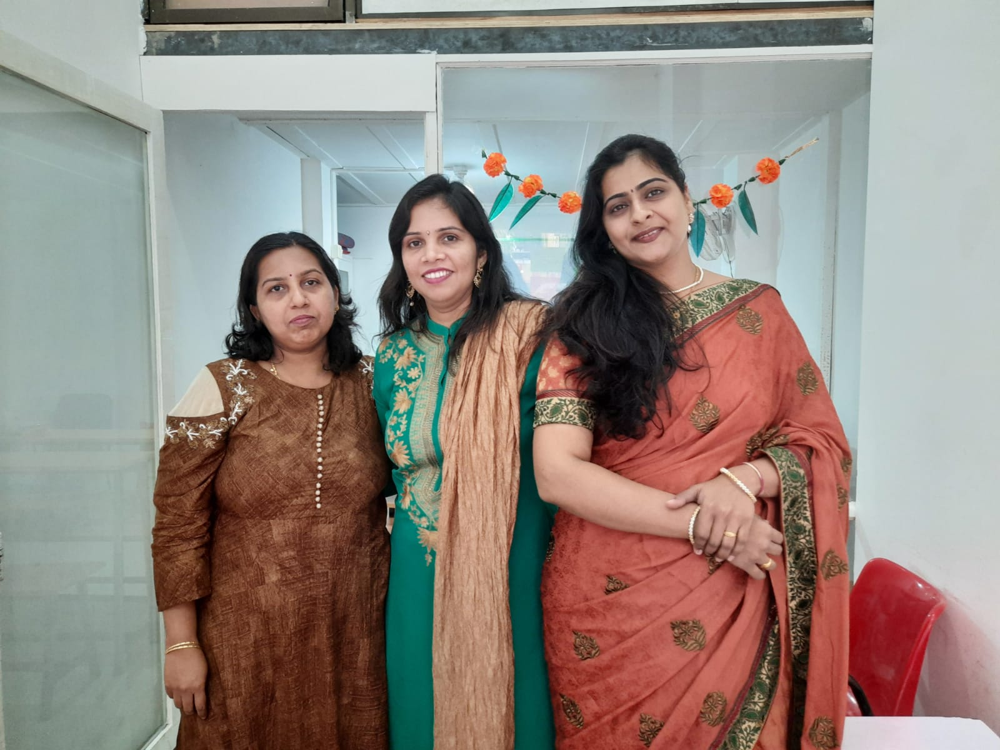
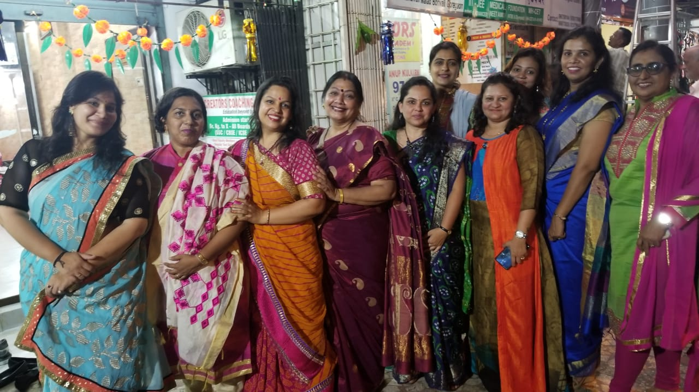

  

    <input type="radio" id="switchOne" name="switchPlan" value="VAZIRA" checked="checked" />
    <input type="radio" id="switchTwo" name="switchPlan" value="NEW ASHOK NAGAR" />
    <input type="radio" id="switchThird" name="switchPlan" value="GORAI 2017-MARCH 2020" />
    <label for="switchOne">VAZIRA</label>
    <label for="switchTwo">NEW ASHOK NAGAR</label>
    <label for="switchThird">GORAI 2017-MARCH 2020</label>
    

      

        
VAZIRA

        
NEW ASHOK NAGAR

        
GORAI 2017-MARCH 2020

      

    

  

<!-- Vazira branch -->
<ul style="list-style:none; margin: 0; padding: 0; display: grid; gap: 0.5rem; grid-template-columns: repeat(auto-fit, minmax(20rem, 1fr)); max-width: 100%; width: 70rem;">
	<li>
		<a href="">
			<figure>
				
				<!--<figcaption>Mountains and volcanos</figcaption>-->
			</figure>
		</a>
	</li>
	<li>
		<a href="">
			<figure>
				
				<!--<figcaption>Mountains and volcanos</figcaption>-->
			</figure>
		</a>
	</li>
	<li>
		<a href="">
			<figure>
				
				<!--<figcaption>Mountains and volcanos</figcaption>-->
			</figure>
		</a>
	</li>
	<li>
		<a href="">
			<figure>
				
				<!--<figcaption>Mountains and volcanos</figcaption>-->
			</figure>
		</a>
	</li>
	<li>
		<a href="">
			<figure>
				
				<!--<figcaption>Mountains and volcanos</figcaption>-->
			</figure>
		</a>
	</li>
	<li>
		<a href="">
			<figure>
				
				<!--<figcaption>Mountains and volcanos</figcaption>-->
			</figure>
		</a>
	</li>
	<li>
		<a href="">
			<figure>
				
				<!--<figcaption>Mountains and volcanos</figcaption>-->
			</figure>
		</a>
	</li>
	<li>
		<a href="">
			<figure>
				
				<!--<figcaption>Mountains and volcanos</figcaption>-->
			</figure>
		</a>
	</li>
	<li>
		<a href="">
			<figure>
				
				<!--<figcaption>Mountains and volcanos</figcaption>-->
			</figure>
		</a>
	</li>
	<li>
		<a href="">
			<figure>
				
				<!--<figcaption>Mountains and volcanos</figcaption>-->
			</figure>
		</a>
	</li>
	<li>
		<a href="">
			<figure>
				
				<!--<figcaption>Mountains and volcanos</figcaption>-->
			</figure>
		</a>
	</li>
	<li>
		<a href="">
			<figure>
				
				<!--<figcaption>Mountains and volcanos</figcaption>-->
			</figure>
		</a>
	</li>
	<li>
		<a href="">
			<figure>
				
				<!--<figcaption>Mountains and volcanos</figcaption>-->
			</figure>
		</a>
	</li>
</ul>

<!-- Vazira branch ends -->

<!-- new ashok nagar -->

<!-- new ashok nagar ends -->

<!-- Gorai branch -->

<!-- Vazira branch -->
<ul style="list-style:none; margin: 0; padding: 0; display: grid; gap: 0.5rem; grid-template-columns: repeat(auto-fit, minmax(20rem, 1fr)); max-width: 100%; width: 70rem;">
	<li>
		<a href="">
			<figure>
				
				<!--<figcaption>Mountains and volcanos</figcaption>-->
			</figure>
		</a>
	</li>
	<li>
		<a href="">
			<figure>
				
				<!--<figcaption>Mountains and volcanos</figcaption>-->
			</figure>
		</a>
	</li>
	<li>
		<a href="">
			<figure>
				
				<!--<figcaption>Mountains and volcanos</figcaption>-->
			</figure>
		</a>
	</li>
	<li>
		<a href="">
			<figure>
				
				<!--<figcaption>Mountains and volcanos</figcaption>-->
			</figure>
		</a>
	</li>
	<li>
		<a href="">
			<figure>
				
				<!--<figcaption>Mountains and volcanos</figcaption>-->
			</figure>
		</a>
	</li>
	<li>
		<a href="">
			<figure>
				
				<!--<figcaption>Mountains and volcanos</figcaption>-->
			</figure>
		</a>
	</li>
	<li>
		<a href="">
			<figure>
				
				<!--<figcaption>Mountains and volcanos</figcaption>-->
			</figure>
		</a>
	</li>
	<li>
		<a href="">
			<figure>
				
				<!--<figcaption>Mountains and volcanos</figcaption>-->
			</figure>
		</a>
	</li>
	<li>
		<a href="">
			<figure>
				
				<!--<figcaption>Mountains and volcanos</figcaption>-->
			</figure>
		</a>
	</li>
	<li>
		<a href="">
			<figure>
				
				<!--<figcaption>Mountains and volcanos</figcaption>-->
			</figure>
		</a>
	</li>
	<li>
		<a href="">
			<figure>
				
				<!--<figcaption>Mountains and volcanos</figcaption>-->
			</figure>
		</a>
	</li>
	<li>
		<a href="">
			<figure>
				
				<!--<figcaption>Mountains and volcanos</figcaption>-->
			</figure>
		</a>
	</li>
	<li>
		<a href="">
			<figure>
				
				<!--<figcaption>Mountains and volcanos</figcaption>-->
			</figure>
		</a>
	</li>
    <li>
		<a href="">
			<figure>
				
				<!--<figcaption>Mountains and volcanos</figcaption>-->
			</figure>
		</a>
	</li><li>
		<a href="">
			<figure>
				
				<!--<figcaption>Mountains and volcanos</figcaption>-->
			</figure>
		</a>
	</li><li>
		<a href="">
			<figure>
				
				<!--<figcaption>Mountains and volcanos</figcaption>-->
			</figure>
		</a>
	</li><li>
		<a href="">
			<figure>
				
				<!--<figcaption>Mountains and volcanos</figcaption>-->
			</figure>
		</a>
	</li><li>
		<a href="">
			<figure>
				
				<!--<figcaption>Mountains and volcanos</figcaption>-->
			</figure>
		</a>
	</li><li>
		<a href="">
			<figure>
				
				<!--<figcaption>Mountains and volcanos</figcaption>-->
			</figure>
		</a>
	</li><li>
		<a href="">
			<figure>
				
				<!--<figcaption>Mountains and volcanos</figcaption>-->
			</figure>
		</a>
	</li><li>
		<a href="">
			<figure>
				
				<!--<figcaption>Mountains and volcanos</figcaption>-->
			</figure>
		</a>
	</li>
</ul>

<!-- Gorai branch ends -->

